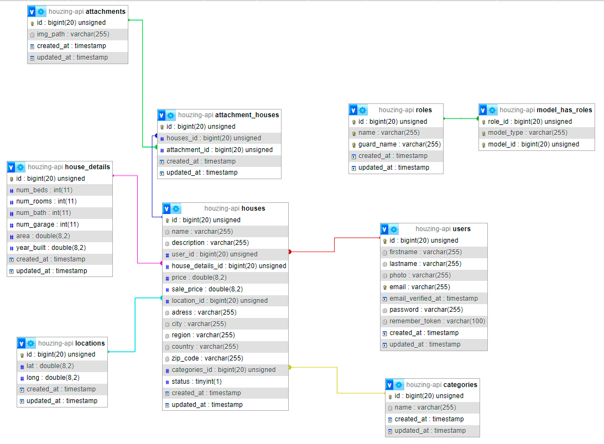

<p align="center"><a href="https://laravel.com" target="_blank"></a></p>

## About Houzing Api

Houzing Api in Laravel

DB Scheme:
```sql
SELECT * FROM `houzing` WHERE `id` = 1; ))
<- I used Elequent ORM, so I didnt write MySQL queries ->
```


## Installation

#### Requirements:
- PHP ^8.1
- Composer
- MySQL

1) Clone the repository
```bash
$ git clone https://github.com/zakaryadev/houzing-api.git
```
2) Install dependencies

```bash
cd houzing-api
composer install
```
3) Create .env file
```bash
cp .env.example .env
```

4) Generate app key
```bash
php artisan key:generate
```

5) Create database and set credentials in .env file
```json
DB_CONNECTION=mysql
DB_HOST=your_host
DB_PORT=your_port
DB_DATABASE=your_database
DB_USERNAME=your_username
DB_PASSWORD=your_password
```
6) Run migrations and start server

```bash
php artisan migrate
php artisan serve
```
## Author
[Zakarya Muratbaev](https://github.com/zakaryadev)